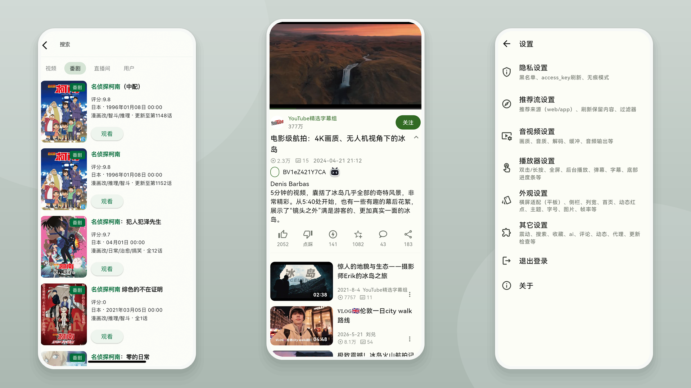

<div align="center">
  <h1>PiliPalaZ</h1>
  <p>使用 Flutter 开发的哔哩哔哩非官方第三方客户端</p>

  [](https://github.com/gxwane/PiliPalaZ/releases/latest)
  [](https://github.com/gxwane/PiliPalaZ/actions/workflows/release.yml)
  [](https://github.com/gxwane/PiliPalaZ/releases)
  [](LICENSE)
</div>

PiliPalaZ 面向 Android 与 iOS，提供视频浏览、播放、互动和个人内容管理等常用功能，并持续适配较新的 Flutter 与移动平台工具链。

<div align="center">
  
</div>

## 主要功能

- 内容发现：推荐、热门、直播、动态，以及覆盖番剧、国创、电影、电视剧、纪录片和综艺的影视中心与多类型搜索。
- 影视播放：支持剧集进度续播、选集与连播；会员、付费、地区或 DRM 受限内容遵循哔哩哔哩官方权益，接口提供试看时可播放试看片段。
- 视频播放：画质与音质选择、弹幕、字幕、倍速、播放记忆、手势控制、画中画和横屏适配。
- 互动管理：点赞、投币、收藏、评论、关注、黑名单、稍后再看、观看记录和站内消息。
- 使用体验：亮色/暗色主题、动态取色、高刷新率、游客模式、无痕模式和丰富的播放偏好。

<div align="center">
  
</div>

## 下载

安装包统一发布在 [GitHub Releases](https://github.com/gxwane/PiliPalaZ/releases)。

- Android：优先选择 `arm64-v8a` 安装包；不确定设备架构时可使用 `universal` 通用包。项目也会按发行矩阵提供 `armeabi-v7a` 与 `x86_64` 构建。
- iOS：Release 中的 IPA 为未签名构建，需要使用者自行签名并安装。

应用内的更新检查同样使用本仓库的 GitHub Releases。稳定版只接收稳定版更新，预发布版可继续接收后续预发布版或稳定版。

## 隐私与诊断

PiliPalaZ 不接入遥测、行为分析或远程崩溃上报服务，项目维护者不会自动收到用户的使用情况或错误信息。应用正常功能会按用户操作直接访问哔哩哔哩相关接口，更新检查会访问 GitHub Releases；这些功能请求不属于项目维护者的数据收集。

应用默认仅在故障发生时，将最小必要的脱敏诊断信息保存在本设备，包括应用版本、系统与设备兼容信息、错误堆栈，以及不含内容标识和媒体地址的播放器技术状态。正常播放过程不会持久化。诊断记录最多保留 7 天，合计不超过 1 MiB，用户可以在“设置 → 隐私设置”中关闭或清空。

PiliPalaZ 不会自动上传诊断记录。只有用户在“关于 → 本地诊断”中审阅并主动复制或调用系统分享后，所选内容才可能离开设备；后续数据处理由用户选择的接收方负责。

## 开发

当前构建基线如下：

| 组件 | 版本/要求 |
| --- | --- |
| Flutter | 3.38.7 |
| Dart | 3.10.7 |
| Java | JDK 17 |
| Android Gradle Plugin | 8.11.1 |
| Kotlin Gradle Plugin | 2.2.20 |
| Gradle | 8.14 |
| Android SDK | compileSdk/targetSdk 36，minSdk 24 |
| iOS | GitHub Actions 的 macOS 最新运行环境 |

获取依赖并执行基础检查：

```bash
fvm install
fvm flutter pub get --enforce-lockfile
fvm flutter analyze --no-pub --fatal-warnings --no-fatal-infos
fvm flutter test --no-pub
fvm flutter build apk --debug --no-pub
```

仓库通过 `.fvmrc` 固定 Flutter 3.38.7。Windows 允许项目与 Pub Cache 位于不同盘符；若 Kotlin 增量编译出现 `different roots` 并导致构建失败或频繁回退，可将 `PUB_CACHE` 配置到项目所在盘符。FVM 不能替代 Pub Cache，个人绝对路径也不应写入仓库。

正式 Android 与 iOS 构建由 GitHub Actions 的 Release 工作流完成。版本变更请同步更新 `pubspec.yaml` 和 [CHANGELOG.md](CHANGELOG.md)，提交前应完成格式化、测试和对应平台构建检查。

问题与功能建议请提交到 [GitHub Issues](https://github.com/gxwane/PiliPalaZ/issues)。

## 维护与来源

本项目采用人机协作方式持续维护。部分代码、问题分析、测试和文档由 OpenAI Codex 协助完成，相关变更在发布前由人工测试。

本项目基于 guozhigq/pilipala 与 orz12/PiliPalaX 延续开发，感谢原作者及所有贡献者。

- [guozhigq/pilipala](https://github.com/guozhigq/pilipala)
- [orz12/PiliPalaX](https://github.com/orz12/PiliPalaX)

## 声明

PiliPalaZ 是非官方第三方客户端，与哔哩哔哩及其关联主体无隶属、授权或合作关系。本项目仅供学习与技术交流，使用者应遵守当地法律法规及相关平台规则。

本项目不提供任何破解内容。使用第三方客户端可能受到平台接口、账号策略和服务可用性变化的影响，相关风险由使用者自行判断和承担。

## 许可证与致谢

本项目采用 [GPL-3.0](LICENSE) 许可证。

感谢以下项目及其贡献者：

- [bilibili-API-collect](https://github.com/SocialSisterYi/bilibili-API-collect)
- [media-kit](https://github.com/media-kit/media-kit)
- [Flutter](https://github.com/flutter/flutter)
- [Dio](https://pub.dev/packages/dio)
